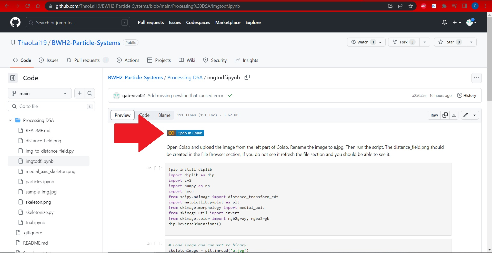
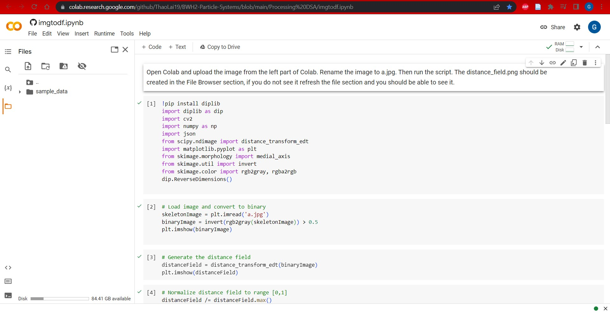
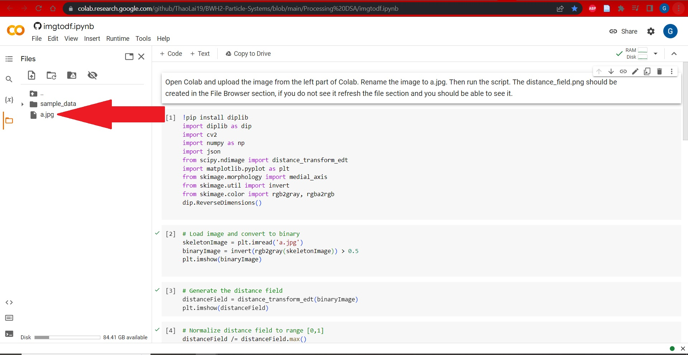
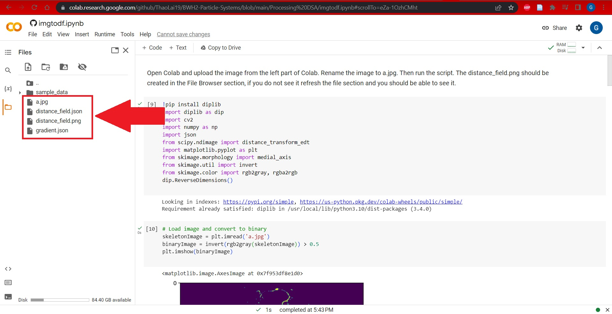
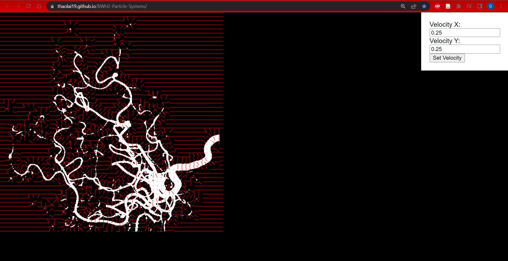

# BWH2-Particle-Systems

### Table Of Contents

- [Table of Contents](#table-of-contents)
- [Software Info](#software-info)
- [Overview](#overview)
- [Installation](#installation)
- [Usage](#usage)
- [Affiliations](#affiliations)
- [Acknowledgements](#acknowledgements)

### Software Info:

Documentation: https://docs.google.com/document/d/1o4FpqekJZHNXjsEQsWUTkCyVB5JIpj3Ii3M7rsOJNxs/edit?usp=sharing

Demo: https://thaolai19.github.io/BWH2-Particle-Systems/

### Overview

The goal of this project is to create a blood flow simulator using a 2D particle system. First, the project loads a digital subtraction angiography (DSA) image of a brain, which then becomes the environment for the particle simulation. Then, the user is free to generate particles inside the blood vessels of the brain by clicking inside the vessel. Finally, the user is free to observe how the environment of the blood vessels affects the particles' movement. Ideally, the particles will stay inside the vessels, and they will only move and bounce around inside the vessels.

## Installation

1. Clone this repo
2. Run index.html on a local server

However, at this point, the blood vessel you will be observing consists of pre-existing test data coming from the repo. If you wish to run another DSA image of a brain, the process for doing so is as follows: 

## Usage

1. On the GitHub repo webpage, click on the "Processing DSA" directory
2. In this directory, click on the "imgtodf.ipynb" file
3. Click on the button shown to open "imgtodf.ipynb" in Google Colab

4. Having opened "imgtodf.ipynb" in Google Colab, click the "Files" icon on the left vertical sidebar to open up a file directory accessible to the program. The result should look like this:

5. Upload the desired DSA image into the file directory with the name "a.jpg". The result should look like this:

6. Execute every cell in the Colab window
7. Make sure that the files "distance_field.json" and "gradient.json" were created after executing Step 6. They should be visible in the same directory that "a.jpg" was placed into. The result should look like this:

8. Download "distance_field.json" and "gradient.json"
9. Replace the existing "distance_field.json" and "gradient.json" in the local copy of the repo with the new "distance_field.json" and "gradient.json" files created in Step 6
10. Run "index.html" in a local server, and observe the file running in a web browser window.
11. Click on any space inside the vessel to generate a particle there. Set the x and y velocity of any future generated particles with the text input boxes.

## Affiliations

[UMass Boston CS 410: Software Engineering](https://cs410.net/)

Brigham and Women's Hospital / Harvard Medical School

## Acknowledgements

Special Thanks to:

Daniel Haehn (CS 410 Instructor, UMB)

Mahsa Geshvadi (CS 410 TA, UMB)

Sarah Frisken (Client, BWH/HMS)

for giving us the opportunity to work on this project, and for all their help in making this project possible.

